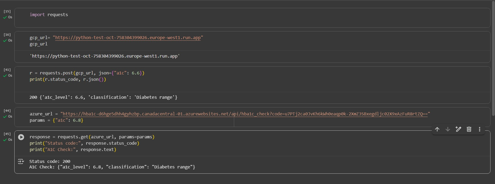

# 504_serverless_functions

Reference for [A1C Range](https://diabetes.org/about-diabetes/a1c#:~:text=A1C%20target%20levels%20can%20vary,be%20lower%20than%20your%20eAG.)

## Video for [Serversless Cloud Servers](https://www.loom.com/share/f965a31d8cf74cc5b4efa131b40e7612?sid=4495f202-67c4-44e1-821e-78e82e1c5cef)

## Google Collab Image



## GCP
function url-https://python-test-oct-758304399026.europe-west1.run.app

### Code
```import json
import functions_framework

@functions_framework.http
def a1c_check(request):
    """HTTP Cloud Function.
    Expects JSON with 'a1c' (or query param as fallback).
    Returns a JSON classification of A1C levels.
    """

    # Prefer JSON body; fall back to query parameters for convenience
    data = request.get_json(silent=True) or {}
    args = request.args or {}
    a1c = data.get("a1c") or args.get("a1c")

    if a1c is None:
        return (
            "Please provide an 'a1c' value. Example: a1c= 6.1",
            400,
        )

    try:
        a1c_val = float(a1c)
    except ValueError:
        return ("Invalid input. 'a1c' must be numeric.", 400)

    # Classification
    if a1c_val < 5.7:
        category = "Normal range"
    elif 5.7 <= a1c_val < 6.5:
        category = "Prediabetes range"
    else:
        category = "Diabetes range"

    result = {
        "a1c_level": a1c_val,
        "classification": category
    }

    return (
        json.dumps(result),
        200,
        {"Content-Type": "application/json"},
    )
```


## AZURE
function url-https://hba1c-d6hge5dhh4gyhzbp.canadacentral-01.azurewebsites.net/api/hba1c_check?code=u7PTj2ca0JvKh6kWh0eaqp0k-2XmZ3SBxegdljc02X9xAzFuR8rtZQ==

### Code
```import azure.functions as func
import logging
import json

app = func.FunctionApp(http_auth_level=func.AuthLevel.FUNCTION)

@app.route(route="hba1c_check")
def hba1c_check(req: func.HttpRequest) -> func.HttpResponse:
    logging.info('HbA1C classification function processed a request.')

    a1c = req.params.get('a1c')
    if not a1c:
        try:
            body = req.get_json()
            a1c = body.get('a1c')
        except ValueError:
            a1c = None

    if a1c is None:
        return func.HttpResponse(
            "Input an 'a1c' value. Eg a1c=6.1",
            status_code=400
        )

    try:
        a1c_val = float(a1c)
    except ValueError:
        return func.HttpResponse("Invalid input. 'a1c' must be numeric.", status_code=400)

    if a1c_val < 5.7:
        category = "Normal range"
    elif 5.7 <= a1c_val < 6.5:
        category = "Prediabetes range"
    else:
        category = "Diabetes range"

    return func.HttpResponse(
        json.dumps({"a1c_level": a1c_val, "classification": category}),
        status_code=200
    )
```
